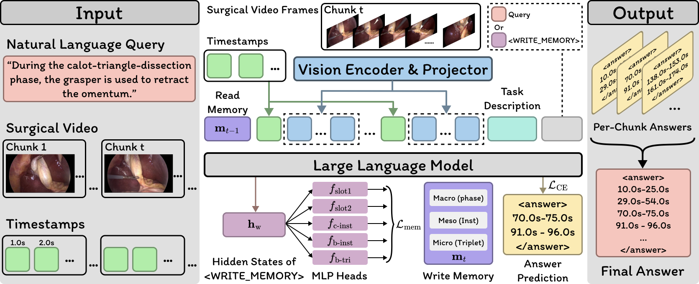

# Surgical Video Temporal Grounding

Official repository for our MICCAI 2026 paper, **Surgical Video Temporal Grounding**.

Surgical Video Temporal Grounding (SurgVTG) localizes temporal segments in surgical videos that match natural-language queries. HMS-SurgVTG provides phase-, instrument-, and action-triplet-level annotations for this task.

## Dataset

The dataset is available in [data/hms_surgvtg](data/hms_surgvtg/README.md).

| Split | Videos | Phase | Instrument | Triplet | Queries |
| --- | ---: | ---: | ---: | ---: | ---: |
| Train | 35 | 239 | 530 | 1,089 | 1,858 |
| Test | 15 | 100 | 220 | 488 | 808 |
| Total | 50 | 339 | 750 | 1,577 | 2,666 |

The data directory contains query annotations, video splits, category mappings, and statistics. Video frames are available separately through [CholecT50](https://github.com/CAMMA-public/cholect50).

## Code

Training and inference code will be added under `src/surgvtg/`, with execution scripts in `scripts/` and configurations in `configs/`.

## Attribution

The dataset uses CholecT50 from CAMMA, ICube, University of Strasbourg. See the dataset [NOTICE](data/hms_surgvtg/NOTICE.md) and [LICENSE](data/hms_surgvtg/LICENSE) for attribution and terms of use.

## Citation

Coming soon.
